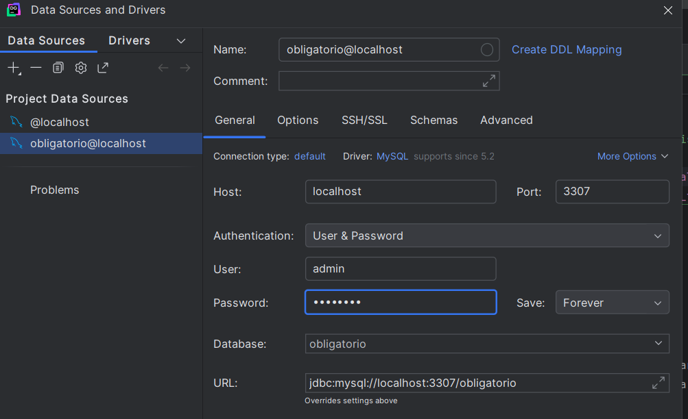
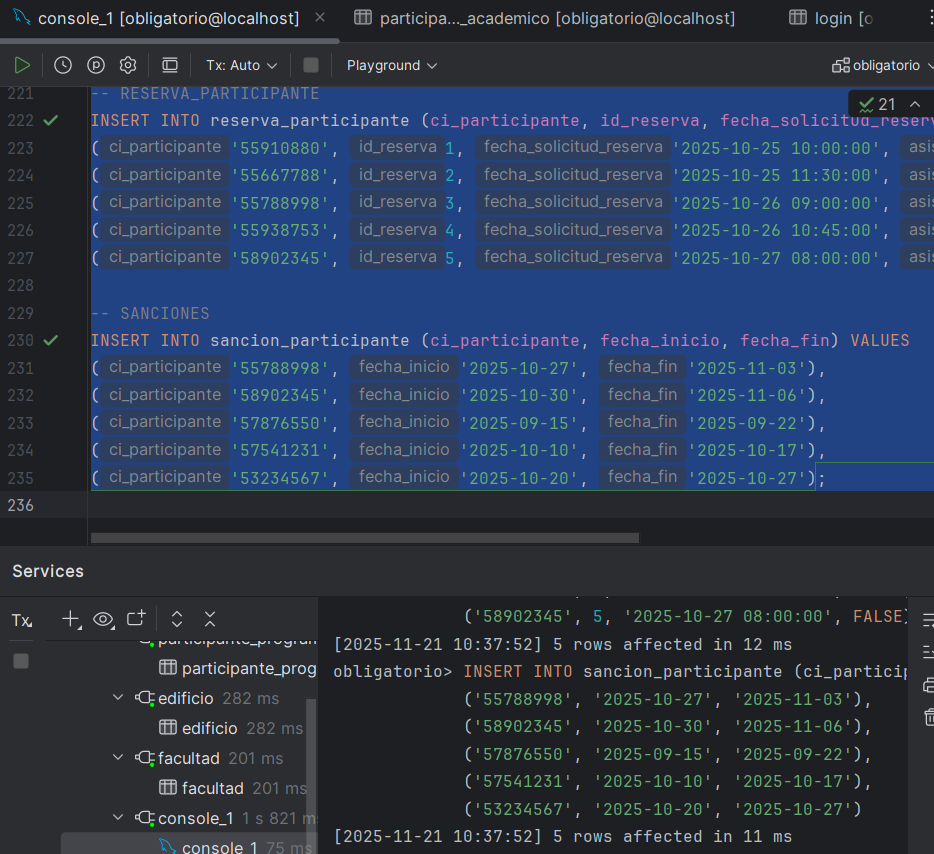

# BDI-Obligatorio — V. Blanco · A. González · B. Kanas  
**Trabajo Obligatorio - Segundo Semestre 2025 - Base de Datos I**  
**Docentes:** Prof. Juan Kosut | Sofía Guerrico  

---

## 📘 Sistema para la Gestión de Reserva de Salas de Estudio

El objetivo central del trabajo obligatorio es diseñar, modelar e implementar un sistema que permita digitalizar el proceso de reserva, control de asistencia y administración de salas utilizado en los distintos edificios de la Universidad Católica del Uruguay, reemplazando los registros manuales en papel actualmente empleados en biblioteca, secretaría y administración.

---

## 🏫 Descripción General

El sistema implementado permite:

+ Registrar y gestionar salas, edificios, programas académicos, turnos y usuarios.
+ Realizar, modificar y cancelar reservas.
+ Controlar automáticamente reglas de uso (horarios, capacidades, restricciones diarias y semanales)
+ Registrar asistencia de participantes por reserva
+ Generar sanciones automáticas cuando se incumplen determinadas condiciones de uso
+ Proveer endpoint REST para su consumo desde un cliente móvil o web.

### Modelado y Reglas del Sistema
El sistema implementa las reglas definidas en la consigna:

+ Horario disponible: 08:00 a 23:00
+ Reservas por bloques de 1 hora
+ Límite de 2 horas diarias por usuario
+ Límite de 3 reservas activas por semana
+ Excepciones para docentes y estudiantes de posgrado al utilizar salas exclusivas
+ Control de asistencia por participante
+ Generación automática de sanciones por inasistencia

La arquitectura está organizada en torno a **tres capas principales**:

1. **Capa de Base de Datos (MySQL)**:
Contiene el modelo relacional, con claves primarias, relaciones referenciales consistentes y restricciones necesarias.
2. **Capa de Backend (Flask - Python)**:
Implementa la lógica de los endpoints, validaciones necesarias y servicios.
3. **Contenedor Docker**:
Permite la ejecución aislada del backend y base de datos
---

## 📁 Estructura del Proyecto Backend
```
backend_flask/
│
├── app/
│   │
│   ├── database/
│   │   ├── __init__.py
│   │   └── conexion_db.py
│   │
│   ├── endpoints/
│   │   ├── __init__.py
│   │   ├── edificio_bp.py
│   │   ├── facultad_bp.py
│   │   ├── login_bp.py
│   │   ├── participante_bp.py
│   │   ├── participante_programa_academico_bp.py
│   │   ├── programa_academico_bp.py
│   │   ├── reserva_bp.py
│   │   ├── reserva_participante_bp.py
│   │   ├── reserva_reportes_bp.py
│   │   ├── sala_bp.py
│   │   ├── sancion_participante_bp.py
│   │   └── turno_bp.py
│   │
│   ├── services/
│   │   ├── __init__.py
│   │   ├── edificio_service.py
│   │   ├── facultad_service.py
│   │   ├── login_service.py
│   │   ├── participante_service.py
│   │   ├── participante_programa_academico_service.py
│   │   ├── programa_academico_service.py
│   │   ├── reserva_service.py
│   │   ├── reserva_participante_service.py
│   │   ├── reserva_reportes_service.py
│   │   ├── sala_service.py
│   │   ├── sancion_participante_service.py
│   │   └── turno_service.py
│   │
│   ├── __init__.py           # configuración de la aplicación Flask
│   └── __main__.py           # punto de entrada principal: `python -m app`
│
├── Dockerfile
├── requirements.txt
│
├── documentacion/           # archivos del informe y material de apoyo
│   ├── TrabajoObligatorio-V.Blanco,A.Gonzalez,B.Kanas.pdf
│   └── Bitacora.pdf
│
├── sql/
│   ├── 1- Creación de Base de Datos y Tablas.sql
│   ├── 2- Inserción Tablas.sql
│   ├── 3- Consultas.sql
│   └── schema.sql
│
├── .env
├── .gitignore
├── config_local.json
├── docker-compose-obligatorio.yml
├── package-lock.json
└── README.md
```
---

## 🛠️ Tecnologías Utilizadas

### Backend
+ Python
+ Flask (Uso de Blueprints, JSON Provider, CORS)
+ Uso de Postman para la prueba de Endpoints
### Base de Datos
+ MySQL (Modelo relacional normalizado)
+ Scripts SQL incluidos en /sql
### Infraestructura
+ Docker (Con Docker Desktop como herramienta)
+ Variables de entorno mediante `.env`

---
## Variables de Entorno (.env)
El archivo `.env` debe contener los datos de conexión a MySQL:

```
# Credenciales de base de datos
MYSQL_ROOT_PASSWORD=rootpassword
MYSQL_DATABASE=obligatorio
MYSQL_USER=admin
MYSQL_PASSWORD=admin123
```
---

## 🛠 Instalación y Ejecución

### Construcción y levantamiento del proyecto con Docker

Desde la raiz del repositorio, ejecutar:
```
docker compose -f docker-compose-obligatorio.yml up --build
```
Esto levanta el contenedor **MySQL** y el **Flask Backend**

### Establecer conexión del modelo en DataGrip
Teniendo en cuenta los datos envueltos en `.env`, completar los campos siguiendo la imagen:



### ⚠️ IMPORTANTE: Es necesario cargar la base de datos
#### Esta parte es manual. Para realizarlo se debe ejecutar el archivo `schema.sql` desde la consola de DataGrip con conexión al entorno del obligatorio.



--- 

## 📊 Endpoints Disponibles

A continuación se detallan todos los endpoints expuestos por la API REST, organizados por módulo, incluyendo ruta, método HTTP y descripción.

### 🏢 Edificios (_edificio_bp_)
| Método     | URL                            | Descripción                    |
| ---------- | ------------------------------ | ------------------------------ |
| **GET**    | `/edificios`                   | Listar todos los edificios     |
| **GET**    | `/edificios/<id_edificio>` | Obtener un edificio específico |
| **POST**   | `/edificios`                   | Crear un edificio              |
| **DELETE** | `/edificios/<id_edificio>` | Eliminar un edificio           |

### 🏛 Facultades (_facultad_bp_)

| Método     | URL                         | Descripción                 |
| ---------- | --------------------------- | --------------------------- |
| **GET**    | `/facultades`               | Listar todas las facultades |
| **GET**    | `/facultades/<id_facultad>` | Obtener una facultad por ID |
| **POST**   | `/facultades`               | Crear facultad              |
| **DELETE** | `/facultades/<id_facultad>` | Eliminar facultad           |

### 🔐 Auth / Login (_login_bp_)
| Método   | URL         | Descripción       |
| -------- | ----------- | ----------------- |
| **POST** | `/login`    | Iniciar sesión    |
| **POST** | `/register` | Registrar usuario |

### 👥 Participantes (_participante_bp_)
| Método     | URL                   | Descripción                    |
| ---------- | --------------------- | ------------------------------ |
| **GET**    | `/participantes`      | Listar todos los participantes |
| **GET**    | `/participantes/<ci>` | Obtener participante por CI    |
| **POST**   | `/participantes`      | Crear participante             |
| **DELETE** | `/participantes/<ci>` | Eliminar participante          |

### 🎓 Participante ↔ Programa Académico (_participante_programa_academico_bp_)
| Método     | URL                                      | Descripción                             |
| ---------- | ---------------------------------------- | --------------------------------------- |
| **GET**    | `/participantes_programa_academico`      | Listar relaciones participante–programa |
| **GET**    | `/participantes_programa_academico/<id>` | Obtener relación por ID                 |
| **POST**   | `/participantes_programa_academico`      | Crear relación                          |
| **DELETE** | `/participantes_programa_academico/<id>` | Eliminar relación                       |

### 📚 Programas Académicos (_programa_academico_bp_)
| Método     | URL               | Descripción       |
| ---------- | ----------------- | ----------------- |
| **GET**    | `/programas`      | Listar programas  |
| **GET**    | `/programas/<id>` | Obtener programa  |
| **POST**   | `/programas`      | Crear programa    |
| **DELETE** | `/programas/<id>` | Eliminar programa |

### 📅 Reservas (_reserva_bp_)
| Método   | URL                                  | Descripción                     |
| -------- | ------------------------------------ | ------------------------------- |
| **GET**  | `/reservas`                          | Listar todas las reservas       |
| **GET**  | `/reservas/<id_reserva>`             | Obtener una reserva             |
| **POST** | `/reservas`                          | Crear reserva                   |
| **PUT**  | `/reservas/<id_reserva>/estado`      | Actualizar estado de la reserva |
| **PUT**  | `/reservas/<id_reserva>/asistencias` | Registrar asistencias           |
| **GET**  | `/reservas/detalladas`               | Listado detallado con filtros   |
| **PUT**  | `/reservas/<id_reserva>/cancelar`    | Cancelar reserva                |

### 👥📅 Relación Reserva–Participante (_reserva_participante_bp_)
| Método     | URL                                            | Descripción                         |
| ---------- | ---------------------------------------------- | ----------------------------------- |
| **GET**    | `/reservas-participantes`                      | Listar todas las relaciones         |
| **GET**    | `/reservas/<id_reserva>/participantes`         | Listar participantes de una reserva |
| **POST**   | `/reservas/<id_reserva>/participantes`         | Agregar participante a reserva      |
| **PUT**    | `/reservas/<id>/participantes/<ci>/asistencia` | Actualizar asistencia individual    |
| **DELETE** | `/reservas/<id>/participantes/<ci>`            | Eliminar participante de la reserva |

### 🏫 Salas (_sala_bp_)
| Método     | URL                    | Descripción   |
| ---------- | ---------------------- | ------------- |
| **GET**    | `/salas`               | Listar salas  |
| **GET**    | `/salas/<nombre_sala>` | Obtener sala  |
| **POST**   | `/salas`               | Crear sala    |
| **DELETE** | `/salas/<nombre_sala>` | Eliminar sala |

### 🚫 Sanciones (_sanciones_bp_)
| Método   | URL                                     | Descripción                               |
| -------- | --------------------------------------- | ----------------------------------------- |
| **GET**  | `/sanciones`                            | Listar sanciones                          |
| **GET**  | `/sanciones/activas`                    | Listar sanciones activas                  |
| **GET**  | `/sanciones/<ci>`                       | Sanciones de un participante              |
| **GET**  | `/sanciones/por-rol-tipo`               | Estadísticas por rol y tipo de sala       |
| **GET**  | `/sanciones/participantes-canceladores` | Participantes con más cancelaciones       |
| **POST** | `/sanciones`                            | Crear sanción manual                      |
| **POST** | `/sanciones/automatica/<id_reserva>`    | Crear sanción automática por inasistencia |

### ⏰ Turnos (_turno_bp_)
| Método     | URL            | Descripción    |
| ---------- | -------------- | -------------- |
| **GET**    | `/turnos`      | Listar turnos  |
| **GET**    | `/turnos/<id>` | Obtener turno  |
| **POST**   | `/turnos`      | Crear turno    |
| **DELETE** | `/turnos/<id>` | Eliminar turno |

---

## 🧩 Entregables Incluidos
 
- Script SQL completos (Creación de tablas e inserción de datos) 
- Consultas SQL (simulando reportes y casos de uso)
- Dockerfile + Docker Compose  
- Instructivo completo para correr la aplicación de forma local 
- Documentación formal del proyecto + Bitácora
-  [Link a Workspace de Postman](https://mariabelenkanas.postman.co/workspace/ca3bb8cf-33a5-41fe-82f6-3788387c0468) 


---

## 📅 Facultad de Ingeniería y Tecnologías  
**Universidad Católica del Uruguay — 2025**
